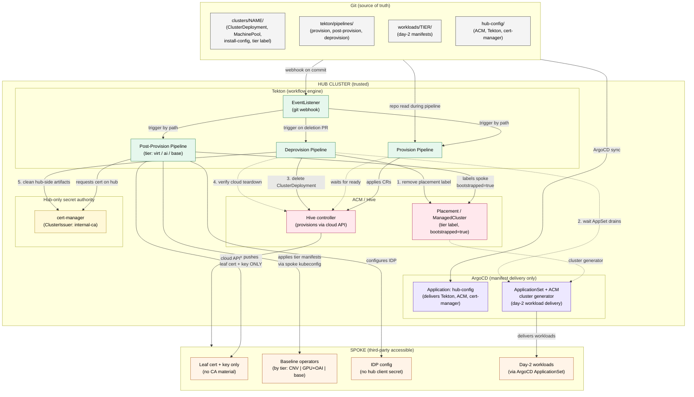
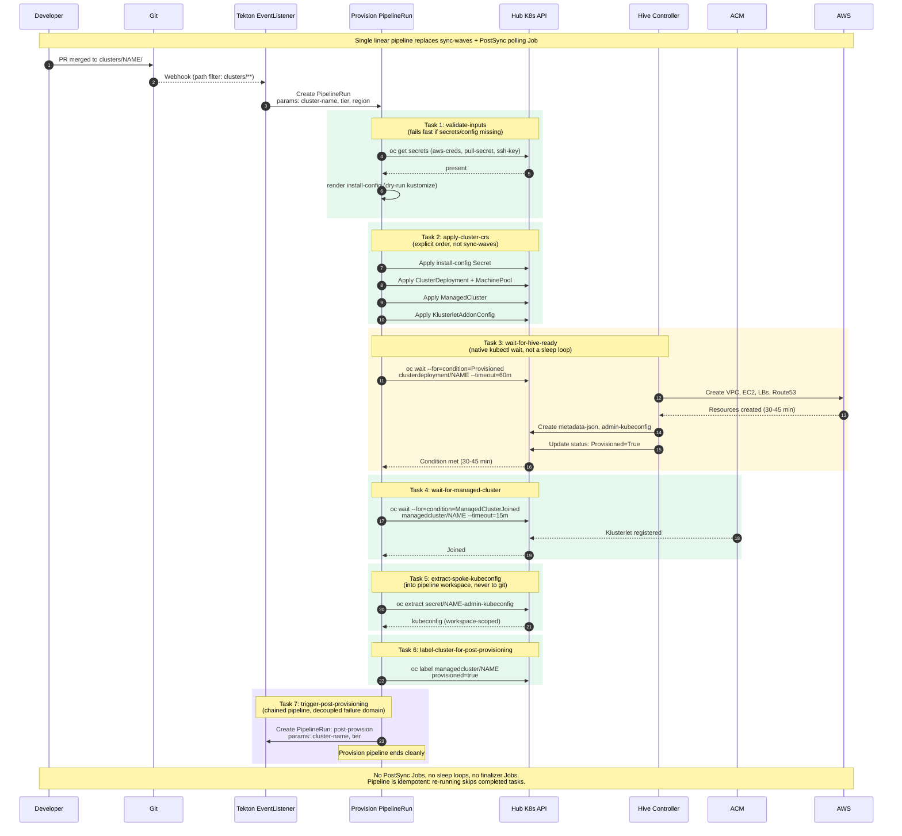
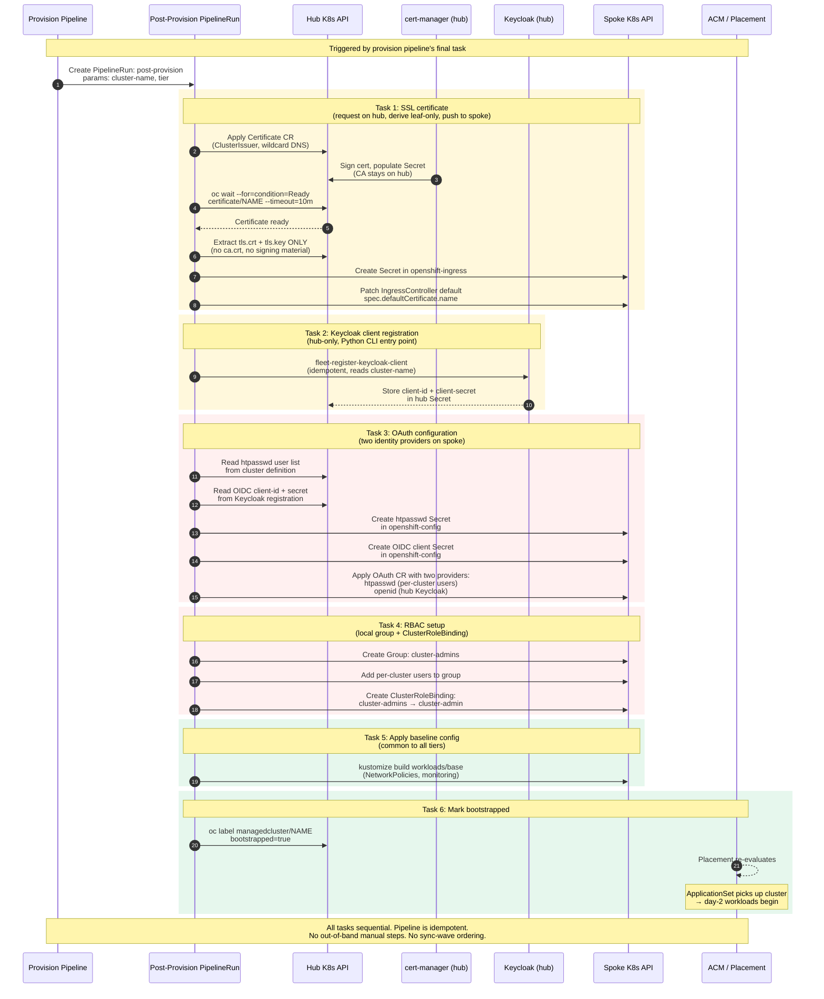
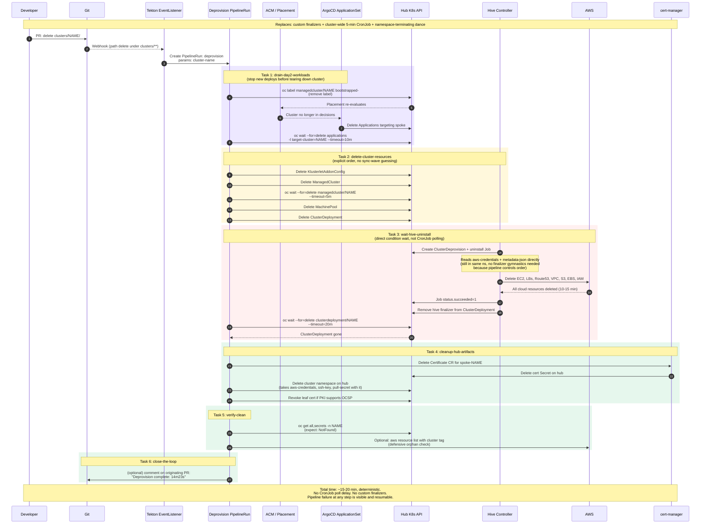

# OpenShift Cluster Lifecycle: Architecture Direction

> **Status:** We are moving from an **ArgoCD-only app-of-apps** model to an **ArgoCD + Tekton + ACM** model for OpenShift cluster lifecycle management on the hub.
>
> This document explains the current state, why it is breaking down, and the target architecture we are moving toward.

---

## TL;DR

| | Current | Target |
|---|---|---|
| **Orchestration** | ArgoCD app-of-apps with sync waves | Tekton pipelines |
| **Manifest delivery (hub)** | ArgoCD | ArgoCD (unchanged) |
| **Day-2 workload delivery (spoke)** | ArgoCD Application per cluster | ArgoCD `ApplicationSet` with ACM cluster generator |
| **Cluster provisioning** | Hive, driven by ArgoCD-applied CRs | Hive, driven by Tekton-applied CRs |
| **Wait for cluster ready** | PostSync `Job` polling every 30s | `oc wait --for=condition=Provisioned` inside a Tekton task |
| **Secret protection during deprovision** | Custom finalizers + cluster-wide 5-min `CronJob` | Pipeline controls the order; no custom finalizers needed |
| **Tier variation (virt / AI / base)** | N/A (not yet supported cleanly) | Tekton post-provision for imperative steps; tier workload delivery approach TBD (see §7) |
| **Hub → spoke secret handoff** | Out-of-band `oc create secret` + implicit trust | Explicit Tekton task that derives and pushes the minimum |
| **Total deprovision time** | 15–25 min (up to 5 min CronJob poll tail) | ~15–20 min, deterministic, no poll tail |

**Rule of thumb going forward:** *ArgoCD reconciles declarative state. Tekton runs ordered workflows. ACM/Hive controls cluster lifecycle. Each tool does one job.*

---

## 1. Current State

### 1.1 How it works today

The current repo (`bootstrap/argocd-app-of-apps.yaml` + `clusters/<name>/`) implements the app-of-apps pattern:

1. A top-level ArgoCD `Application` recurses into `clusters/*/argocd-application.yaml`
2. Each cluster directory declares a child `Application` that applies `ClusterDeployment`, `MachinePool`, `ManagedCluster`, `KlusterletAddonConfig`, and an `install-config` Secret
3. Sync waves (`-1` → `0` → `1` → `2`) order the CR application
4. A `PostSync` `Job` polls every 30 seconds waiting for Hive to create the `<cluster>-metadata-json` Secret, then stamps finalizers onto `aws-credentials` and `<cluster>-metadata-json`
5. On deletion, a cluster-wide `CronJob` runs every 5 minutes, scans for labeled secrets, checks whether the Hive uninstall `Job` succeeded, and patches finalizers off so namespace deletion can complete

### 1.2 What the code is actually doing (and what that reveals)

Reading the workflow docs in the repo against the code:

- `argocd-app-of-apps.yaml` has `ignoreDifferences` on `/status` for both `ClusterDeployment` and `ManagedCluster`. This is **necessary** because Hive owns the status subresource — but it means ArgoCD is deliberately blind to the readiness of what it just applied.
- The `secret-persistence-workflow.md` doc describes a **13-phase** flow involving sync waves, a polling Job, custom finalizers, and a CronJob.
- `deprovision-cleanup-cronjob.yaml` is a 195-line CronJob (bash-in-YAML) running every 5 minutes **cluster-wide**, scanning every namespace for labeled secrets, correlating them to Hive uninstall Jobs by naming convention (`CLUSTER_NAME="$NAMESPACE"`), and patching finalizers off.
- Users create AWS credentials, pull secret, and SSH keys with `oc create secret` out-of-band *before* ArgoCD can do anything — meaning git is the source of truth for *config* but not for secrets, and cluster creation requires human imperative steps.

### 1.3 Root cause: we are using a reconciler as a workflow engine

Applying first-principles thinking:

> **ArgoCD's purpose** is to make cluster state match git. It is a *reconciler* — it converges toward a desired state.
>
> **Cluster provisioning** is an *ordered workflow* — each step has preconditions, produces outputs, may take 30–45 minutes, can fail in distinct ways, and depends on later steps knowing what earlier steps produced.

These are different shapes of problem. Every compensator in the current repo — the polling PostSync Job, the custom finalizers, the cluster-wide CronJob, the 30-second sleep loops — exists because ArgoCD cannot natively express: *"wait for this condition to become true, then do the next thing, and if that fails, retry only that step."*

We have effectively re-implemented a workflow engine on top of a reconciler, using CronJobs and finalizers as the control-flow primitives. That is the architectural smell we are fixing.

### 1.4 Concrete pain points (mapped to code)

| Pain | Where it shows up in the repo |
|---|---|
| ArgoCD cannot wait for async conditions | `PostSync` Job with 30-second polling loop for `metadata-json` |
| Sync waves are advisory, not hard gates | Cross-CR ordering issues under load |
| Deletion races ArgoCD's own prune | Custom `openshiftpartnerlabs.com/deprovision` finalizer added after the fact |
| Nothing is watching for "uninstall done" | 5-minute cluster-wide `CronJob` polling Hive Jobs |
| Cluster name ↔ namespace coupling is load-bearing | `CLUSTER_NAME="$NAMESPACE"` in the CronJob script |
| Secrets live outside git | Manual `oc create secret` before any ArgoCD sync |
| No tier-aware provisioning (virt vs AI) | No clean branch point in a sync-wave-ordered Application |
| Pipeline step failures force full re-sync | ArgoCD resyncs everything, not just the failed stage |

---

## 2. Target Architecture

### 2.1 Division of responsibilities

```
┌──────────────────────────────────────────────────────────────────┐
│                                                                  │
│  Git  →  [ArgoCD: hub manifest delivery]                         │
│          [Tekton: ordered workflows]      →  Hub (ACM, Hive,     │
│          [ArgoCD AppSet: day-2 workloads] →  cert-manager, etc.) │
│                                                                  │
└──────────────────────────────────────────────────────────────────┘
```

- **ArgoCD** delivers *static* manifests to the hub (ACM install, Tekton pipelines, cert-manager config, baseline operators). It is no longer responsible for ordering the cluster lifecycle. **Crossplane** is a pre-installed prerequisite for per-cluster IAM user generation but is not managed by this repo.
- **ArgoCD `ApplicationSet`** with the ACM cluster generator delivers *day-2 workloads* to spokes once Tekton has labeled them `bootstrapped=true`.
- **Tekton** owns three workflows: **provision**, **post-provision** (SSL, OAuth/IDP, RBAC), and **deprovision**. Each is a single auditable `PipelineRun` per cluster operation.
- **ACM / Hive** continues to provision clusters and manage fleet membership. No change to its role.
- **Git** remains the source of truth. Tekton `EventListener` on webhooks from the repo decides which pipeline to kick off based on the path that changed.

### 2.2 High-level architecture



### 2.3 Trust boundary (why this constraint shapes the design)

Spokes are third-party accessible. PII and proprietary material must stay on the hub. Our hard boundary:

- **Hub holds** the CA/signing authority, IDP client secrets, pull secrets of record, PII-laden config.
- **Spoke holds** only derived artifacts: the leaf TLS cert and its private key, the OIDC config referencing a pre-issued client secret, tier-specific operators.
- **No hub Secret data or PII** is ever committed to git or written to the spoke directly as-is.
- **Crossplane** is pre-installed on the hub as a prerequisite (not managed by this repo). It handles per-cluster IAM user generation.

This is why a Tekton task owns the derive-and-push step. ArgoCD cannot express "read hub Secret, extract subset, push to spoke" with a trust boundary in the middle — not without external controllers bolted on. A Tekton task executing with a hub ServiceAccount can.

---

## 3. The Three Pipelines

### 3.1 Provisioning pipeline

Replaces: sync waves, `PostSync` polling Job, 30-second sleep loops.

Key difference: `oc wait --for=condition=Provisioned` is a native Kubernetes primitive for waiting. A Tekton task using it is dramatically simpler, more observable, and more correct than a bash loop in a `Job`.



### 3.2 Post-provisioning pipeline

Replaces: out-of-band `oc create secret` for IDP, manual SSL setup, no RBAC automation.

The post-provision pipeline is a **linear Tekton pipeline** that runs after the provision pipeline completes and before the cluster is labeled `bootstrapped=true`. It handles three concerns that require imperative, ordered execution across the hub–spoke trust boundary:

1. **SSL certificate** — request via cert-manager on hub, derive leaf-only material, push to spoke
2. **Keycloak + OAuth** — register OIDC client on hub Keycloak (Python CLI, idempotent), configure spoke OAuth with two providers (htpasswd + openid)
3. **RBAC** — create a local `cluster-admins` group on spoke, bind to `cluster-admin`

Tier-specific workload delivery (CNV, GPU operators) is a separate decision — see section 7.

**Per-cluster user list:** Each cluster definition (`clusters/<name>/`) specifies the htpasswd users for that cluster. These users are added to both the htpasswd identity provider and the `cluster-admins` group. This is the convention for per-cluster access control.

**Keycloak client registration:** An existing idempotent Python script registers a new OIDC client in the hub Keycloak instance. Per CLAUDE.md constraints, this script is packaged as a `pyproject.toml` entry point and invoked by a thin bash stub in the Tekton Task YAML. The task produces a client ID and secret, stored in a hub-side Secret for the OAuth configuration task to consume.



### 3.3 Deprovisioning pipeline

Replaces: `deprovision-cleanup-cronjob.yaml` + custom finalizer + namespace-terminating dance.

The key insight: **when the pipeline controls the order, finalizers become unnecessary**. The current design needs finalizers because ArgoCD prune can delete `aws-credentials` before Hive has finished using it — the pipeline prevents that by simply not doing those things in parallel.



---

## 4. What We Keep, What We Remove, What We Add

### 4.1 Keep

- **Git as source of truth** for cluster definitions, tier labels, pipeline definitions, and day-2 workload manifests.
- **ArgoCD** for delivering hub-side static manifests — the Tekton installation itself, ACM config, cert-manager `ClusterIssuer`, baseline hub operators.
- **ArgoCD `ApplicationSet` with ACM cluster generator** for day-2 workload delivery to spokes. This is ArgoCD at its best: continuous reconciliation of ongoing state against git.
- **ACM + Hive** for the actual cluster provisioning. They are purpose-built for this.
- **The `clusters/<name>/` folder convention** as the trigger surface — a commit under this path is what kicks off Tekton.

### 4.2 Remove

- `bootstrap/argocd-app-of-apps.yaml` as the orchestrator of cluster lifecycle. (A slimmer app-of-apps may remain for delivering *hub config*, but it no longer touches `ClusterDeployment` and friends.)
- The `PostSync` Job that polls for `metadata-json`. Replaced by `oc wait --for=condition=Provisioned` in a Tekton task.
- The custom `openshiftpartnerlabs.com/deprovision` finalizer. Unnecessary once the pipeline controls delete order.
- `bootstrap/deprovision-cleanup-cronjob.yaml`. The CronJob is replaced by the deprovision pipeline's explicit wait tasks.
- The implicit `CLUSTER_NAME="$NAMESPACE"` coupling. Pipelines pass `cluster-name` as a parameter, making the coupling explicit.
- Manual `oc create secret` as a prerequisite step. Secrets are managed as hub-side Kubernetes Secrets, referenced by the pipeline.

### 4.3 Add

- **OpenShift Pipelines (Tekton)** on the hub.
- **A `tekton/` directory** in this repo containing `Pipeline`, `Task`, `TriggerBinding`, `TriggerTemplate`, and `EventListener` definitions for provision, post-provision, and deprovision flows.
- **`cert-manager`** on the hub with a `ClusterIssuer` pointing at internal PKI.
- **A git webhook** on this repo pointing at the Tekton `EventListener`. Pipeline selection is by changed path (`clusters/**` vs `workloads/**` vs deletion events).
- **Tier labels** on `ManagedCluster` (`tier=virt|ai|base`) read by the post-provision pipeline and by `ApplicationSet` placement.

---

## 5. Why Tekton + ArgoCD + ACM (Not Tekton + ACM Alone)

We explicitly chose to keep ArgoCD rather than replace it wholesale. Reasoning:

| Dropping ArgoCD would mean | Not worth it because |
|---|---|
| Hand-rolling hub-config manifest delivery | ArgoCD does this cleanly; the failure mode we have today is in *cluster lifecycle*, not hub-config delivery |
| Losing `ApplicationSet` with ACM cluster generator for day-2 | This is genuinely well-fit; ongoing reconciliation of workloads is exactly what ArgoCD is for |
| Losing drift detection on hub | ArgoCD's self-heal on hub-config is a safety net we keep |

The surgical change is: **stop asking ArgoCD to do workflow orchestration**. Let it do what it is good at.

---

## 6. Migration Order

Recommended sequence (each step delivers value and is reversible if needed):

1. **Install Tekton + cert-manager on hub** via a new ArgoCD `Application`. Crossplane is a pre-installed prerequisite (not managed by this repo). Hub-config delivery path is unchanged.
2. **Build the provision pipeline** for the `base` tier only. Prove it on one test spoke end-to-end. Do not migrate real clusters yet.
3. **Add the deprovision pipeline**. Migrate one test cluster through its full lifecycle (provision → deprovision) via Tekton. Validate that deprovision finishes cleanly without the CronJob.
4. **Add tier branching** (`virt`, then `ai`) to the post-provision pipeline.
5. **Switch the day-2 delivery model** to `ApplicationSet` with ACM cluster generator. Existing per-cluster ArgoCD `Application`s are replaced by placement-driven generation.
6. **Migrate existing clusters** one at a time. For each cluster: ensure it has the right tier label, let `ApplicationSet` take over, then remove its `argocd-application.yaml` from `clusters/<name>/`.
7. **Retire** `deprovision-cleanup-cronjob.yaml`, the `PostSync` Job, and the custom finalizer only after all clusters have moved. These stay deployed until then as a safety net.

---

## 7. Open Questions / Future Work

- **Ansible vs Tekton for post-provision imperative steps.** Tekton wins for our case (custom logic, external API integration), but if a step is naturally Ansible (e.g., registering with ServiceNow), a Tekton task can invoke an Ansible Runner. We'll decide per step.
- **Spoke drift after bootstrap.** `ApplicationSet` catches workload drift. ACM `Policy` may be worth adding for baseline config enforcement on spokes (NetworkPolicies, baseline RBAC). TBD.
- **Cert rotation.** cert-manager handles renewal on hub automatically. A companion "rotate-spoke-cert" pipeline triggered by renewal events will re-run the push-to-spoke task only. Not in the initial scope.
- **Tier-specific workload delivery model.** Post-provision imperative steps (SSL, OAuth, RBAC) are Tekton tasks. For tier-specific operator installation (CNV, GPU Operator, OpenShift AI), two models remain under consideration: (a) Tekton tasks in the post-provision pipeline with tier branching, or (b) layered ArgoCD ApplicationSets with tier-specific Placement label selectors. Decision deferred until base-tier post-provision is proven end-to-end.
- **Human approval gates.** Prod deprovision should require a human click. Tekton supports this via manual-approval tasks; wiring TBD.

---

## 8. References

- Architecture docs from predecessor repo [`labargocd`](https://github.com/redhat-openshift-partner-labs/labargocd):
  - `secret-persistence-workflow.md`
  - `cluster-deletion-workflow.md`
  - `bootstrap/argocd-app-of-apps.yaml`
  - `bootstrap/deprovision-cleanup-cronjob.yaml`
- Target architecture diagrams are embedded inline in sections 2.2, 3.1, 3.2, and 3.3 above (mermaid format).
- External:
  - [OpenShift Pipelines (Tekton) docs](https://docs.openshift.com/pipelines/)
  - [OpenShift GitOps (ArgoCD) docs](https://docs.openshift.com/gitops/)
  - [Red Hat Advanced Cluster Management docs](https://access.redhat.com/documentation/en-us/red_hat_advanced_cluster_management_for_kubernetes/)
  - [ArgoCD ApplicationSet with ACM cluster generator](https://argo-cd.readthedocs.io/en/stable/operator-manual/applicationset/Generators-Cluster-Decision-Resource/)
