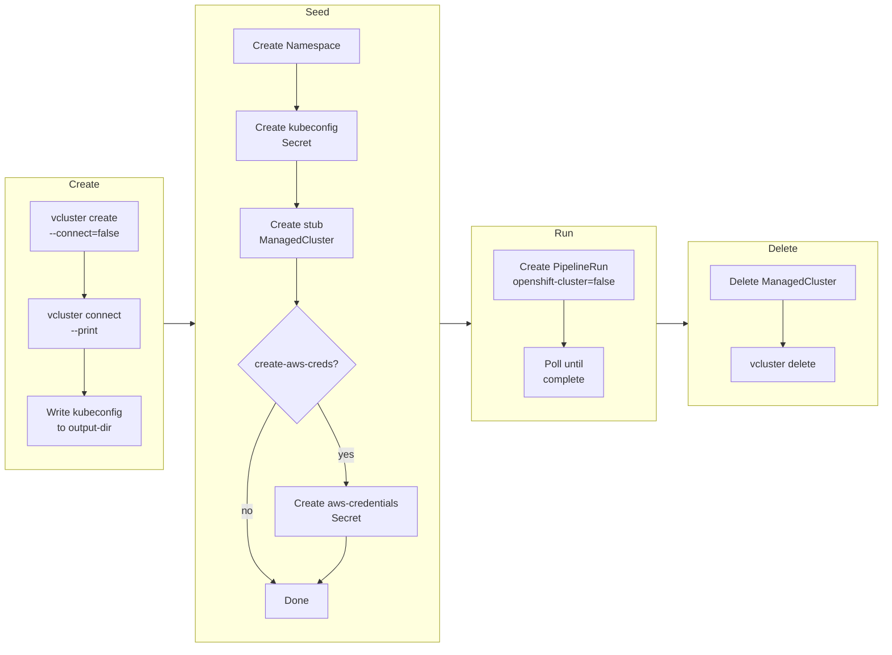
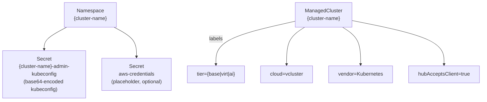
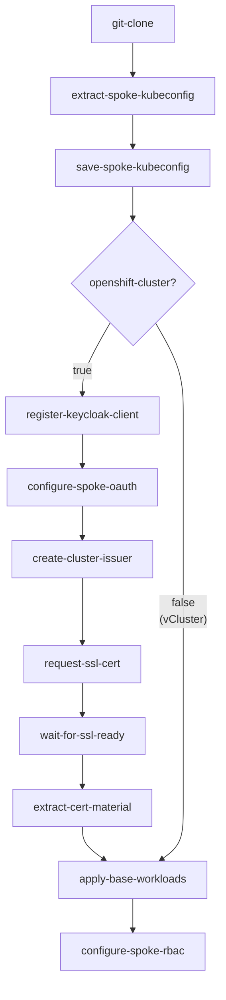

# vCluster Test Infrastructure

## Overview

vCluster provides ephemeral Kubernetes clusters for testing the post-provision
pipeline without provisioning real cloud infrastructure. A vCluster runs as a
set of pods on the hub cluster, presents a full Kubernetes API, and can be
created and destroyed in seconds.

Four CLI tools manage the lifecycle:

| CLI entry point | Source | Purpose |
|---|---|---|
| `fleet-create-test-vcluster` | `fleet/tasks/create_test_vcluster.py` | Create vCluster, extract kubeconfig |
| `fleet-seed-test-vcluster` | `fleet/tasks/seed_test_vcluster.py` | Create hub resources that mimic a real spoke |
| `fleet-run-post-provision` | `fleet/tasks/run_post_provision.py` | Run post-provision pipeline and wait for completion |
| `fleet-delete-test-vcluster` | `fleet/tasks/delete_test_vcluster.py` | Delete vCluster and hub resources |

## Lifecycle



## Hub Resources Created by Seed

The seed tool creates stub resources on the hub so the post-provision pipeline
can run against the vCluster as if it were a real spoke:



## Post-Provision Pipeline Integration

The post-provision pipeline supports both real OpenShift clusters and vCluster
via the `openshift-cluster` param (default: `"true"`). When set to `"false"`,
seven OpenShift-specific tasks are skipped:



Tasks in yellow run only for OpenShift clusters. For vCluster, the pipeline
executes: **git-clone -> extract-spoke-kubeconfig -> save-spoke-kubeconfig ->
apply-base-workloads**.

## CLI Reference

### fleet-create-test-vcluster

| Arg | Required | Description |
|---|---|---|
| `--cluster-name` | yes | Name for the vCluster |
| `--namespace` | yes | Hub namespace to create the vCluster in |
| `--output-dir` | yes | Directory to write the kubeconfig file |
| `--values-file` | no | Custom vCluster Helm values file |

Creates the vCluster with `--connect=false`, then runs `vcluster connect
--print` to extract the kubeconfig and writes it to `<output-dir>/kubeconfig`.
Exits 1 if either command fails.

### fleet-seed-test-vcluster

| Arg | Required | Description |
|---|---|---|
| `--cluster-name` | yes | Cluster name (used for namespace, secret, and ManagedCluster) |
| `--kubeconfig-file` | yes | Path to the kubeconfig extracted in the create step |
| `--tier` | no | Workload tier label: `base` (default), `virt`, or `ai` |
| `--create-aws-creds` | no | Flag; creates a placeholder `aws-credentials` Secret |

Creates hub-side resources so the post-provision pipeline can discover and
operate on the vCluster. The ManagedCluster gets `cloud=vcluster` and
`vendor=Kubernetes` labels to distinguish it from real spokes.

### fleet-run-post-provision

| Arg | Required | Description |
|---|---|---|
| `--cluster-name` | yes | Cluster name (matches the seeded hub resources) |
| `--tier` | yes | Workload tier: `base`, `virt`, or `ai` |
| `--namespace` | yes | Hub namespace the vCluster runs in |
| `--timeout` | no | Max seconds to wait for completion (default: 600) |

Creates a post-provision PipelineRun with `openshift-cluster=false` and
`spoke-kubeconfig` set to `{cluster-name}-admin-kubeconfig`, then polls until
the PipelineRun succeeds or fails. Exits 1 on failure or timeout.

### fleet-delete-test-vcluster

| Arg | Required | Description |
|---|---|---|
| `--cluster-name` | yes | vCluster to delete |
| `--namespace` | yes | Hub namespace the vCluster runs in |

Deletes the ManagedCluster first (to unblock ACM), then runs `vcluster delete`
which removes the vCluster and its namespace.

## test-vcluster Pipeline

The `test-vcluster` Tekton pipeline orchestrates the full test cycle as a
single PipelineRun:

```
create-test-vcluster → seed-test-vcluster → run-post-provision → delete-test-vcluster
```

| Param | Required | Default | Description |
|---|---|---|---|
| `cluster-name` | yes | | Name for the vCluster |
| `namespace` | yes | | Hub namespace to create the vCluster in |
| `tier` | no | `base` | Workload tier label |
| `pipeline-image` | no | `quay.io/rhopl/fleet-pipeline:latest` | Container image |
| `values-file` | no | `""` | Custom vCluster Helm values file (workspace-relative) |
| `extra-sans` | no | `""` | Additional SANs for the vCluster API cert |
| `route-san` | no | `""` | Hostname for a passthrough route to the vCluster |
| `create-aws-creds` | no | `"false"` | Create a placeholder aws-credentials Secret |
| `timeout` | no | `"600"` | Max seconds to wait for post-provision completion |

## How vCluster Differs from Production

| Aspect | Production (Hive) | vCluster |
|---|---|---|
| Provisioning | Hive ClusterDeployment | `vcluster create` on hub |
| Kubeconfig source | ClusterDeployment `.spec.clusterMetadata.adminKubeconfigSecretRef` | `vcluster connect --print`, passed via `spoke-kubeconfig` param |
| ManagedCluster labels | `cloud=AWS`, `vendor=OpenShift` | `cloud=vcluster`, `vendor=Kubernetes` |
| OAuth/IDP | Configured via `configure-spoke-oauth` | Skipped (`openshift-cluster=false`) |
| TLS certificates | cert-manager ClusterIssuer + Let's Encrypt | Skipped |
| Spoke RBAC | OpenShift RBAC bindings | Skipped |
| Day-2 workloads | Full tier-specific overlay | `apply-base-workloads` only |
